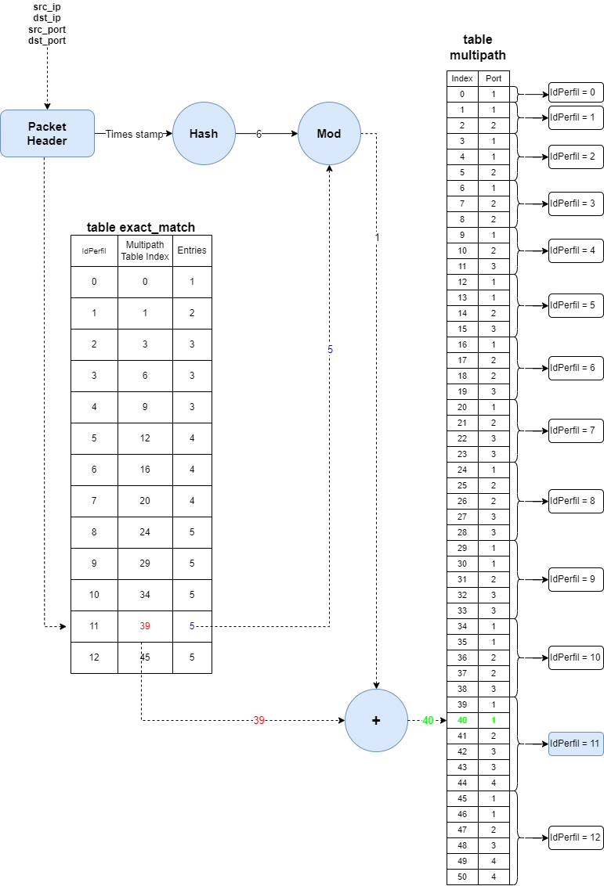
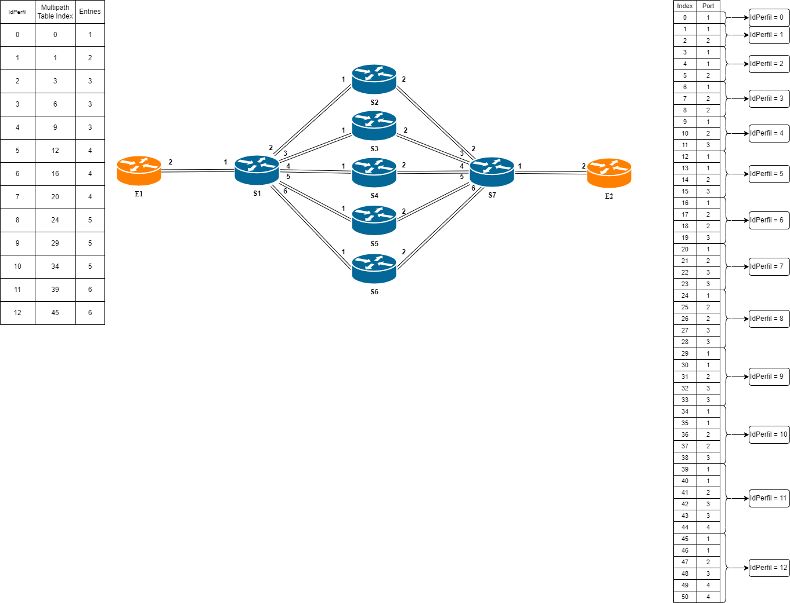

# Traffic Splitting M-PolKA

Neste artigo, será implementado uma forma de divisão de tráfego. O conceito da nossa proposta é colocar o conceito nas entradas de correspondência/ação.  Um algoritmo de balanceamento de carga que distribui o tráfego em vários caminhos para otimizar a utilização de múltiplos links. O objetivo é distribuir a carga de forma proporcional ao custo de cada link, a fim de maximizar o uso de cada um deles. Cada grupo de peso (IdPerfil) está associado a um conjunto de portas de saída e seus pesos. A tabela de multipath descreve as portas de saída para cada grupo de peso (IdPerfil) e replica uma entrada de porta proporcionalmente ao seu peso. Suponha que haja totalmente 5 portas de saída no switch. Conforme a tabela Exact Match, o grupo de peso (IdPerfil 11) tem 5 entradas a partir da 39ª entrada até a 44ª entrada. Entre as 5 entradas, o número de entradas alocadas para as 4 portas é 1, 1, 2, 3, 3, e 4 respectivamente. Assim, a porta de saída 1, 2, 3  tem a seguinte proporção de divisão de tráfego 1:1:2 respectivamente. O tráfego do grupo de peso (IdPerfil 11)  será distribuído para as 5 portas proporcionalmente aos seus pesos. Em seguida, o switch executa o hash usando o times stamp sobre o cabeçalho do pacote e gera um resultado de 6. O resultado do hashing é o número de entradas para o grupo de peso, ou seja, 6 mod 5, e obtém um resultado de 1. Em seguida, o switch adiciona o resultado do mod para o índice base 39 do grupo e obtém 40, que é o índice da entrada da tabela para cuja porta de saída o pacote de entrada será encaminhado. Quanto maior o peso da porta de saída, mais entradas ela ocupa e maior a probabilidade de ser hash.

# Cenário

