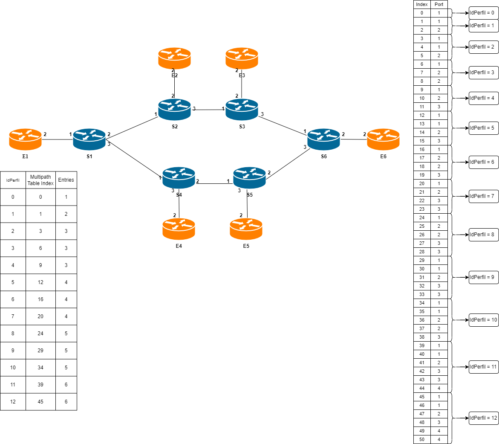

<<<<<<< HEAD
# MTS-PolKA: Divisão de tráfego multicaminho em proporção de peso com roteamento na fonte

O artigo apresenta a abordagem MTSPolKA para otimizar o tráfego em redes de data centers com múltiplos caminhos redundantes, visando equilibrar a carga de forma dinâmica e eficiente entre os caminhos para maximizar a largura de banda. A abordagem é baseada em roteamento de fonte multicaminho, permitindo que a fonte faça escolhas de distribuição usando rótulos nos pacotes. Isso possibilita a divisão dinâmica do tráfego sem reconfigurações complexas nas tabelas de comutação. Ao contrário de abordagens anteriores, a MTS-PolKA utiliza sistema numérico de resíduos para roteamento de fonte sem armazenamento de estado. Testes demonstram eficácia na distribuição de tráfego e melhorias em relação a abordagens convencionais. MTS-PolKA é uma solução inovadora para otimização do tráfego em redes de data centers, pois permite alterar a distribuição de tráfego de forma simultânea em todos os switches do caminho.

# Cenário

# Organização dos arquvivos

- <data> - diretório onde são armazenados os dados adquiridos no experimento
- <envio> - diretório onde os scripts de envio de mensagens.
- <m-polka> - diretório onde estão os aruivos em p4 de configuração dos switches edges e core.
- <topologia> - diretório onde estão os arquivos da topogia.
- calc_routeid-wid.py- calcula do routeid e wid das portas de transmissão.
- run_cenario_topology.py - executa o mininet com a topologia MTS-PolKA.

=======
# MTS-PolKA
>>>>>>> ba173979e91ff3814d336e6a6ffba071a9b868f8
